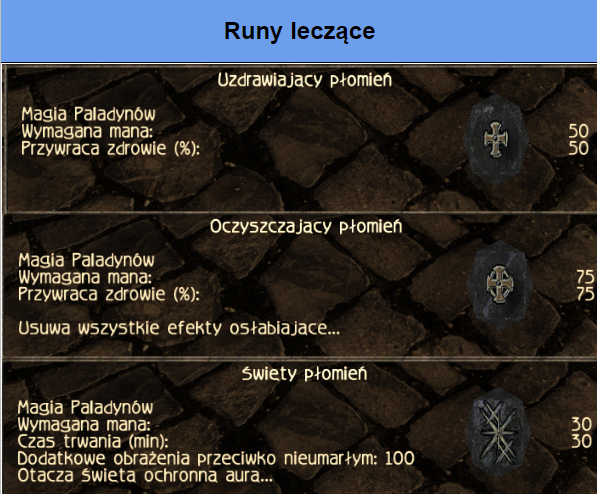

[gildie_id]: #gildie 
[bronie_id]: #bronie
[paladyn_id]: #strażnikpaladyn
[kwiatki_id]: #kwiatki
[korzen_id]: #smoczy-korzeń

# ___Menu___
[__Gildie__][gildie_id]

[__Bronie__][bronie_id]

[__Kwiatki__][kwiatki_id]

# Gildie
[__Strażnik/Paladyn__][paladyn_id]
## Strażnik/Paladyn
---
___Informacje ogólne___

____Dar Specjalny____

 

___Konserwacja Miecza___

 

___Prezentacja Run___

 

__Runy Leczące__

 

[__powrót do kategorii__][paladyn_id]

__Runy Atakujące__

[__powrót do kategorii__][paladyn_id]

__Pancerze Strażnika/Palladyna__

[__powrót do kategorii__][paladyn_id]

__Bronie Strażnika/Paladyna__

# Bronie

# Kwiatki

[Smoczy Korzeń][korzen_id]

# Smoczy Korzeń

____Khorinis/Fort Azgan/Las Asasynów/Etlu____

[Powrót do korzenia][korzen_id]

